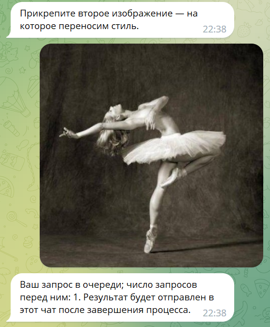

# Style Transfer TG Bot

Итоговый проект Deep Learning School — Телеграм-бот, который переносит стиль одного
изображения на другое.

Код для переноса стиля взят из туториала на сайте PyTorch ([ссылка](https://pytorch.org/tutorials/advanced/neural_style_tutorial.html)), в основе — модель VGG19
(веса скачиваются из репозитория PyTorch).

## Установка

1. Склонировать репозиторий.

2. Задать значение переменной окружения `TG_BOT_TOKEN` (API-ключ бота);
например, через файл .env (должен быть в директории проекта).

3. Выполнить команду `python app.py`. Бот будет запущен.

### Docker

Чтобы создать Docker-образ, необходимо выполнить (из директории проекта):

```docker build -t tg_bot .```

Чтобы создать контейнер из образа, необходимо выполнить:

```docker run --rm -d --name tg_bot tg_bot```

(образ весит более 7 GB).

В контейнере необходимо задать значение переменной окружения `TG_BOT_TOKEN`.

## Скриншоты работы TG-бота

1. Запуск бота (команда `/start`):

    

    Пример некорректного ввода:

    

2. После вызова команды `/transfer_style` необходимо по очереди отправить
два изображения: источник стиля и изменяемое изображение. Скриншоты:

    

    Пример некорректного ввода (изображения необходимо прикреплять как фото):

    

    После отправки обоих изображений, если в очереди нет запросов от других пользователей, генерация нового изображения начнется немедленно — об этом будет сказано в ответном сообщении:

    

    Если в очереди есть несколько запросов, в ответном сообщении будет указано их количество:

    

    (алгоритмом в любой момент времени генерируется изображение не более, чем для одного запроса).

    Во время генерации изображения пользователю каждые 10 итераций алгоритма приходит сообщение
    о номере текущей итерации (всего итераций 520) и значениях функций потерь; предыдущее аналогичное сообщение удаляется:

    

    Пользователь не может отправить еще один запрос на генерацию изображения, пока не обработан предыдущий запрос этого же пользователя:

    

3. Пример результата:

    
